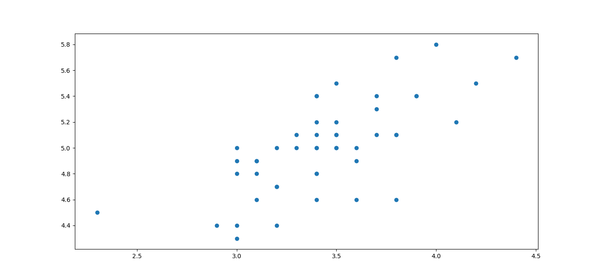
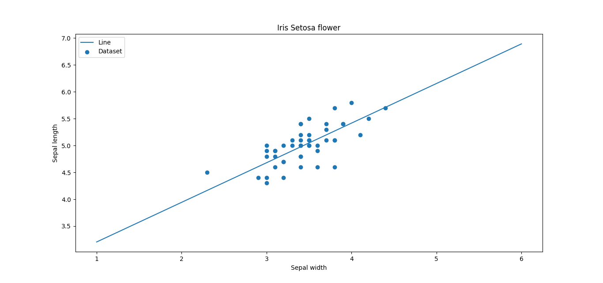

# 100 days of ML code
I have been working on Machine learning from last few weeks. And I came across the Siraj's Video to take up the pledge of 100 days of ML coding. I created this Reopository to mark my progress.

## Day 1
### (7th July 2018 IST 15:54)

***Today's progress*** :  Started with ML. Revised Python. 
***Thoughts*** : Today I started with the book "Data Science from scratch - first principles" by Joel Grus. I read first chapter which mostly gives introduction to data science. It also talks about some real time problem and their solutions. I also revised some python syntax and watched 10-12 videos of Sentdex Python Intermediate. I also got a video series on Machine learning by Andre NG. I will start the video series from tommorow.

## Day 2
### (8th July 2018 IST 21:29)

***Today's progress*** :  Started with Andrew NG. Started with gradient descent. 
***Thoughts*** : Today I started with my first algorithm for machine learning. I saw Siraj Raval's Video about Linear Regression using gradient descent. I typed code along with him. But, i dont know why, his output and my output differ on the same dataset. I must have done something wrong. Then, I saw videos from Andrew NG about linear regression. He explained it in a different manner. His notations and explaination was different. But after 2-3 videos i figured it out that it was the same as explained by siraj. I dont think i can say i understood gradient descent 100% but i will keep trying to study and understand how to minimize cost using it. Tomorrow i will continue watching Andrew NG's videos and read next chapter from the book "Data Science from scratch - first principles" by Joel Grus. 
***Link to work*** : [linear regression](https://github.com/DevashishPrasad/100_Days_of_ML_Code/tree/master/Linear-regression)

## Day 3
### (10th July 2018 IST 16:05)

***Today's progress*** : Fixed the error in linear regression 
***Thoughts*** : Today I fixed the error in my linear regression code. The error was very minute mistake in the formula of gradient descent. I also saw next videos in series of Andrew NG. He explained linear regression in other way. He also explained gradient descent. And now i can say that i have a better understanding of the algorithm. I need to focus and learn more about calculus to be perfect in gradient descent. Later in his video series he started with Linear algebra. I already knew about basics of it so watched a couple of videos in 1.75x speed. Tomorrow I will start will next chapter from book "Data Science from scratch - first principles" by Joel Grus. 
***Link to work*** : [linear regression error fixed](https://github.com/DevashishPrasad/100_Days_of_ML_Code/tree/master/Linear-regression)

## Day 4
### (11th July 2018 IST 16:20)
***Today's progress*** : Started with Linear Regression with multiple variables 
***Thoughts*** : Today I fininshed the basics linear algebra such as - Matrices and Vectors, Addition and Multiplication, Inverse and Transpose. I also started with Linear regression with multple variables or multiple features. Andrew NG explained the difference between both algorithms. 
We get our new function as - **h(x) = t0 + t1x1 + t2x2 + ..... + tnxn** (Where n us number of features). I also learnt about optimization of our new function. The new gradient descent algorithm which is derivative of cost function is repeated till the convergence for all values of ti (Where i is the index of a feature). 
Inorder to optimize the gradient descent for our algorithm we make sure that our features lie on the same scale. This is known as feature scaling. For eg - we have two features as  **x1 = size( 0 - 2000 ) feet** and **x2 = num_of_rooms (1 - 5)**. So, we can scale these features as **x1= size()/2000 therefore, 0 <= x1 <= 1 and x2 = num_of_rooms()/5 therefore, 0 <= x2 <= 1**. In this way, our gradient descent will converge faster. 
***Link to work*** : [linear regression with multiple variables](https://github.com/DevashishPrasad/100_Days_of_ML_Code/tree/master/Linear-Regression-with-multiple-variable)

## Day 5
### (12th July 2018 IST 16:20)
***Today's progress*** : Linear Regression with multiple variables 
***Thoughts*** : Today I continued watching Andrew NG. I learnt about the properties of gradient descent such as number of iterations required and learning rate. We should use a threshold such as 10^-3, if rate of change decreases this threshold value we stop iterating. Learning rate should be ideal. If Learning rate is too small then gradiemt descent will take longer to converge. If learning rate is large then it may overshoot. I also learned how to make new features from existing features inorder to simplify our algorithm. Instead of a straight line we can also fit a polynomial functions. I did not get enough time today but will cover huge amout of work this weekend.  
***Link to work*** : [linear regression with multiple variables](https://github.com/DevashishPrasad/100_Days_of_ML_Code/tree/master/Linear-Regression-with-multiple-variable)

## Day 6
### (16th July 2018 IST 22:50)
***Today's progress*** : An alternative for gradient descent 
***Thoughts*** : Today I continued watching Andrew NG. I learnt about the normal equation used to minimizde the weights or the theta in the hypothesis equation of linear regression. The equation is **t = (XT * X)^-1 * XT * y (where XT = X Transpose)**. This equation has some pros and some cons. Advntages of this equation are  1) It does not require any learning rate 2) It does not require iterations.  Disadvantages of this equation are -   1) It is unsuitable for large dataset 2) It fails when XT * X is non-invertible I also learnt about a new language recommended by Andrew NG for machine learning "Octave". I installed Octave on my computer and performed basic opertaions such as Arithmetic operations, Using Matrices and Vectors, initializing matrices and vectors using inbuilt functions. 

## Day 7
### (17th July 2018 IST 22:23)
***Today's progress*** : Octave, logistic regression and reinforcement learning 
***Thoughts*** : Today I continued watching Andrew NG. I have now finished watching 32 videos. I learnt about the octave language for ML. I learnt how to move data around like sizing, loading, saving and clearing data. I also learnt about slicing arrays and matrics in octave like we do in Numpy. Computing data is easier in octave. We can use functions like - abs(), max(), log(), exp(), sum(), floor(), ceil(), pinv() etc. We can also plot data in octave using some functions like - plot(), xlabel(), ylabel(), figure(), subplot() and axis(). I feel like octave is a bit complex and I am more familiar with Python. So from now onwards I am convinced that python is the best language for machine learning. Numpy is a great library for performing linear algebra calculations and Matplotlib is great for  visualizing data. So I am done with Octave. 
About Logistic regression I have an introductory knowlege. I learnt that this algorithm is used for classification. Andrew also proves that classification is possible using linear regression but it will fail often. So, best algorithm for classificatio is Logistic regression. Classification is chosen or practiced when we have data with y = 1 or 0. This can be Yes or No, True or False, Red or Blue and what not. We can also use Logistic regression for multi class classification where y can be {0 or 1 or 2 or ... n}. It is again, a type of supervised learning. 
Reinforcement Learning is a type of supervised learning with unlabelled dataset. It has 5 elements - 
1) Actor
2) Environment
3) Reward
4) State
5) Action 

Letz take an example of a self driving car. Here, Car is the actor and Road is environment. Whether the car is moving or still describes the state of the car. When depending on the state and environment car does an action i.e. if there is green light on the signal car moves, then this is known as action. Based on action of the car(actor) we give it a reward. A reward can be positive or negative. For eg. if car moves when light is red is a false action so it gets a negative reward and car moves when light is green is a positive reward.

## Day 8
### (18th July 2018 IST 23:35)
***Today's progress*** : Pandas and Matplotlib 
***Thoughts*** : Today I continued watching Andrew NG. I learnt more about logistic regression. I learnt that we need to use log functions as cost functions for logistic regression. I also learnt about the decision boundaries. Then I decided to practice my own linear regression fro scratch. I started searching for datasets and found the iris petal dataset perfect for simple linear regression. I downloaded it in the form of .xls file. I then used Pandas dataframe to fetch the data can convert it into the numpy arrays. I successfully did it. I aslo watched a tutorial on Pandas library. I learnt to fetch data from various formats such as csv, xml, dict, json etc. I was also able to now use the basic functions such as max(), min(), abs(), describe etc.  
Once i was able to successfully grab the data. I used matplotlib to visualize it. I used scatter plot to visualize it.

***Link to work*** : [simple linear regression or iris setosa sepals](https://github.com/DevashishPrasad/100_Days_of_ML_Code/tree/master/simple%20linear%20regression%20for%20iris%20petals)

## Day 9
### (19th July 2018 IST 23:57)
***Today's progress*** : Linear regression from scratch 
***Thoughts*** : Today I implemented linear-regression model for iris petal dataset from scratch using gradient descent. I took data from xls file through pandas dataframe. Then implemented gradient descent partial derivatives formulae and minized the values of m and c (b) of the equation y = mx + c.  
I finally plotted both the dataset and the line on a chart to visualize the results 
Encountered lot of errors... and solved each one of them
 

***Link to work*** : [simple linear regression or iris setosa sepals](https://github.com/DevashishPrasad/100_Days_of_ML_Code/blob/master/simple%20linear%20regression%20for%20iris%20petals/my_linear.py)

## Day 10
### (20th July 2018 IST 23:59)
***Today's progress*** : Multiple Linear regression from scratch 
***Thoughts*** : Today I read a couple of articles about multiple linear regression. I find it confusing and challenging. I also saw couple of videos which therotically explains how to implement it. I also gathered dataset to work upon. The dataset is systolic blood pressure prediction using age and weight of patient. Today i am successfull in taking data in python code from .xls file through pandas.  
***Link to work*** : [multiple linear regression](https://github.com/DevashishPrasad/100_Days_of_ML_Code/tree/master/Linear-Regression-with-multiple-variable)
